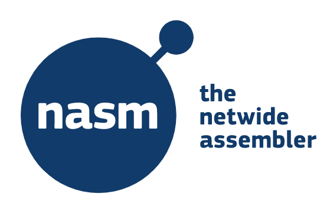

# Assembly Language Programming

##  with Netwide Assembler

Netwide Assembler (NASM), an asssembler for the x86 CPU architecture portable to nearly every modern platform, and with code generation for many platforms old and new.

https://github.com/netwide-assembler/nasm

# Only Ones and Zeros

The processor understands only ones and zeors. (Or low and high voltage cutoffs). Machine language is too complex to write code. Therefore, we have to use assembly language for programming.

# Fetch-decode-execute cycle
